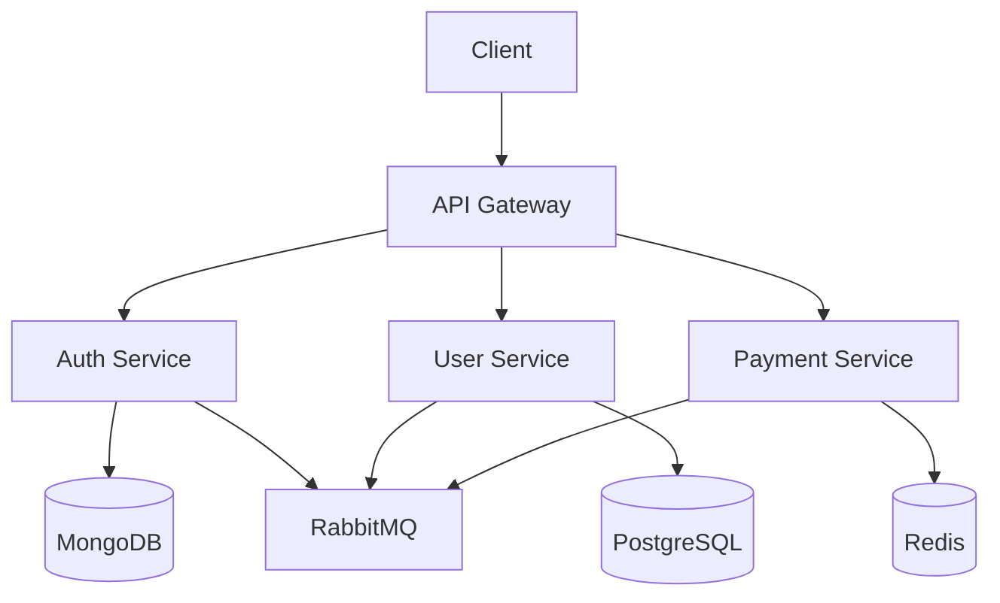

# <div align="center">🚀 Ultra Advanced Monorepo Microservice Architecture</div>

<div align="center">
  


[](https://github.com/your-username/monorepo/actions/workflows/ci-cd.yml)
[](https://codecov.io/gh/your-username/monorepo)
[](https://opensource.org/licenses/MIT)
[](https://github.com/your-username/monorepo/pulls)

</div>

## 📌 Table of Contents
<details>
<summary>Click to expand</summary>

- [🚀 Ultra Advanced Monorepo Microservice Architecture](#-ultra-advanced-monorepo-microservice-architecture)
  - [📌 Table of Contents](#-table-of-contents)
  - [🌟 Key Features](#-key-features)
    - [ Core Architecture](#-core-architecture)
    - [ Advanced Capabilities](#-advanced-capabilities)
  - [🏗️ Architecture](#️-architecture)
    - [ System Design](#-system-design)
  - [📂 Project Structure](#-project-structure)
  - [🛠️ Tech Stack](#️-tech-stack)
    - [ Core Technologies](#-core-technologies)
  - [🚀 Getting Started](#-getting-started)
    - [Prerequisites](#prerequisites)
    - [Installation](#installation)
    - [Development](#development)
    - [VS Code Setup](#vs-code-setup)
  - [🧪 Testing](#-testing)
  - [🐳 Docker \& Kubernetes](#-docker--kubernetes)
    - [Local Development](#local-development)
    - [Production Deployment](#production-deployment)
  - [📈 Monitoring](#-monitoring)
    - [Metrics Dashboard](#metrics-dashboard)
    - [Log Query Example](#log-query-example)
  - [🔒 Security](#-security)
    - [OWASP Top 10 Mitigations](#owasp-top-10-mitigations)
    - [Security Headers](#security-headers)
  - [🤝 Contributing](#-contributing)
    - [Branch Naming Convention](#branch-naming-convention)
    - [Commit Message Format](#commit-message-format)
  - [📄 License](#-license)
  - [📧 Contact](#-contact)
  - [🔮 Future Roadmap](#-future-roadmap)
    - [Q3 2023](#q3-2023)
    - [Q4 2023](#q4-2023)
    - [2024](#2024)
</details>

## 🌟 Key Features

###  Core Architecture
| Feature                  | Description                                | Tech Used                  |
| ------------------------ | ------------------------------------------ | -------------------------- |
| **Type-Safe Monorepo**   | End-to-end type safety across all services | Turborepo, TypeScript      |
| **Microservices**        | Decoupled, domain-driven services          | gRPC, REST, GraphQL        |
| **Event Sourcing**       | CQRS pattern with event replay             | Kafka, RabbitMQ            |
| **Polyglot Persistence** | Right database for each service            | MongoDB, PostgreSQL, Redis |
| **API Gateway**          | Unified entry point with schema stitching  | Apollo Federation, Kong    |

###  Advanced Capabilities
- **Real-time Analytics** with WebSockets and data streaming
- **Machine Learning** integration with Python microservices
- **Feature Flags** for gradual rollouts
- **A/B Testing** framework
- **Dark Mode** with CSS variables and theming
- **Internationalization** with locale-aware formatting



## 🏗️ Architecture

###  System Design
```plaintext
┌───────────────────────────────────────────────────────────────┐
│                        Client Applications                    │
│  ┌─────────────┐       ┌─────────────┐       ┌─────────────┐  │
│  │   Web App   │       │  Mobile App │       │  Desktop    │  │
│  │ (Next.js)   │       │ (React Nat.)│       │  (Electron) │  │
│  └─────────────┘       └─────────────┘       └─────────────┘  │
└───────────────────────────────────────────────────────────────┘
                               │
                               ▼
┌───────────────────────────────────────────────────────────────┐
│                        Edge Network Layer                     │
│  ┌─────────────┐       ┌─────────────┐       ┌─────────────┐  │
│  │  CDN        │       │  Load       │       │  WAF        │  │
│  │ (Cloudflare)│       │  Balancer   │       │ (Protection)│  │
│  └─────────────┘       └─────────────┘       └─────────────┘  │
└───────────────────────────────────────────────────────────────┘
                               │
                               ▼
┌───────────────────────────────────────────────────────────────┐
│                        API Gateway Layer                      │
│  ┌─────────────────────────────────────────────────────────┐  │
│  │  GraphQL Federation │ REST Routes │ gRPC Proxy          │  │
│  └─────────────────────────────────────────────────────────┘  │
└───────────────────────────────────────────────────────────────┘
                               │
                               ▼
┌───────────────────────────────────────────────────────────────┐
│                        Microservices Layer                    │
│  ┌─────────────┐ ┌─────────────┐ ┌─────────────┐ ┌─────────┐  │
│  │ Auth        │ │ User        │ │ Payment     │ │ Search  │  │
│  │ Service     │ │ Service     │ │ Service     │ │ Service │  │
│  └─────────────┘ └─────────────┘ └─────────────┘ └─────────┘  │
└───────────────────────────────────────────────────────────────┘
```

## 📂 Project Structure

```bash
.
├── .github/                   # GitHub configurations
│   ├── workflows/             # CI/CD pipelines
│   │   ├── ci.yml             # Continuous Integration
│   │   ├── cd.yml             # Continuous Deployment
│   │   └── codeql.yml         # Security scanning
│   └── ISSUE_TEMPLATE/        # Issue templates
│
├── apps/                      # Application packages
│   ├── web/                   # Next.js 14 frontend
│   │   ├── app/               # App router directory
│   │   ├── src/               # Application code
│   │   └── public/            # Static assets
│   ├── mobile/                # React Native application
│   └── api-gateway/           # Federated API gateway
│
├── packages/                  # Shared packages
│   ├── config/                # Shared configurations
│   ├── database/              # Database abstractions
│   ├── events/                # Event schemas (TypeScript + Zod)
│   ├── ui/                    # Design system components
│   └── utils/                 # Utility functions
│
├── services/                  # Microservices
│   ├── auth-service/          # Authentication service
│   ├── user-service/          # User management
│   ├── payment-service/       # Payment processing
│   └── ...                    # Other domain services
│
├── infrastructure/            # IaC definitions
│   ├── terraform/             # Terraform modules
│   ├── kubernetes/            # K8s manifests
│   └── helm/                  # Helm charts
│
├── scripts/                   # Utility scripts
├── .env.example               # Environment variables template
├── turbo.json                 # Turborepo configuration
└── package.json               # Monorepo root config
```

## 🛠️ Tech Stack

###  Core Technologies

<details>
<summary><b>Frontend</b></summary>

- **Next.js 14** (App Router, Server Components)
- **React 18** (Concurrent Features)
- **TypeScript** (Strict mode)
- **Tailwind CSS** (Utility-first CSS)
- **Radix UI** (Accessible primitives)
- **Zustand** (State management)
- **React Query** (Data fetching)
- **Framer Motion** (Animations)
</details>

<details>
<summary><b>Backend</b></summary>

- **Node.js** (v20+ with ES Modules)
- **Fastify** (High-performance web framework)
- **GraphQL** (Apollo Federation)
- **gRPC** (High-performance RPC)
- **Prisma** (Type-safe ORM)
- **Zod** (Runtime validation)
- **BullMQ** (Queue management)
- **Jest** (Testing framework)
</details>

<details>
<summary><b>DevOps</b></summary>

- **Docker** (Containerization)
- **Kubernetes** (Orchestration)
- **Terraform** (Infrastructure as Code)
- **GitHub Actions** (CI/CD)
- **Prometheus** (Monitoring)
- **Grafana** (Visualization)
- **Loki** (Log aggregation)
- **Sentry** (Error tracking)
</details>

## 🚀 Getting Started

### Prerequisites

- Node.js v20+
- Docker Desktop
- Kubernetes (Minikube for local)
- Terraform v1.5+

### Installation

```bash
# Clone with submodules
git clone --recurse-submodules https://github.com/your-username/monorepo.git
cd monorepo

# Install dependencies (using pnpm for speed)
pnpm install

# Setup environment variables
cp .env.example .env
```

### Development

```bash
# Start all services in development mode
pnpm dev

# Start specific service
pnpm dev --filter=web

# Generate types across monorepo
pnpm generate
```

### VS Code Setup

1. Install [Dev Containers](https://marketplace.visualstudio.com/items?itemName=ms-vscode-remote.remote-containers) extension
2. Open command palette (`Ctrl+Shift+P`)
3. Select "Remote-Containers: Reopen in Container"

## 🧪 Testing

| Test Type   | Command                 | Coverage Report                                                                    |
| ----------- | ----------------------- | ---------------------------------------------------------------------------------- |
| Unit        | `pnpm test:unit`        | []()          |
| Integration | `pnpm test:integration` | []() |
| E2E         | `pnpm test:e2e`         | []()                 |
| Security    | `pnpm test:security`    | []()         |

## 🐳 Docker & Kubernetes

### Local Development

```bash
# Build and start all containers
docker-compose -f docker-compose.dev.yml up --build

# Scale specific service
docker-compose up --scale auth-service=3
```

### Production Deployment

```bash
# Build production images
docker-compose -f docker-compose.prod.yml build

# Push to registry
docker-compose -f docker-compose.prod.yml push

# Deploy to Kubernetes
kubectl apply -f kubernetes/production
```

## 📈 Monitoring

### Metrics Dashboard
```vega-lite
{
  "data": {"url": "data/monitoring.json"},
  "mark": "line",
  "encoding": {
    "x": {"field": "time", "type": "temporal"},
    "y": {"field": "requests", "type": "quantitative"},
    "color": {"field": "service", "type": "nominal"}
  }
}
```

### Log Query Example
```sql
SELECT 
  timestamp, 
  service, 
  message 
FROM 
  logs 
WHERE 
  level = 'ERROR' 
  AND timestamp > NOW() - INTERVAL '1 HOUR' 
ORDER BY 
  timestamp DESC 
LIMIT 10;
```

## 🔒 Security

### OWASP Top 10 Mitigations

1. **Injection** - Parameterized queries with Prisma
2. **Broken Auth** - JWT with strict validation
3. **Sensitive Data** - Encryption at rest and transit
4. **XXE** - XML parsing disabled
5. **Broken Access** - RBAC with attribute checks
6. **Security Misconfig** - Automated scanning
7. **XSS** - CSP headers and sanitization
8. **Insecure Deserialization** - Strict schema validation
9. **Vulnerable Components** - Dependabot alerts
10. **Insufficient Logging** - Structured logging

### Security Headers
```nginx
add_header X-Frame-Options "DENY";
add_header X-Content-Type-Options "nosniff";
add_header Referrer-Policy "strict-origin-when-cross-origin";
add_header Permissions-Policy "geolocation=(), microphone=()";
add_header Content-Security-Policy "default-src 'self'; script-src 'self' 'unsafe-inline' cdn.example.com;";
```

## 🤝 Contributing

### Branch Naming Convention
```
<type>/<issue-id>-<short-desc>
```
Types:
- `feat` - New feature
- `fix` - Bug fix
- `docs` - Documentation
- `chore` - Maintenance tasks

### Commit Message Format
```
<type>(<scope>): <subject>
<BLANK LINE>
<body>
<BLANK LINE>
<footer>
```

Example:
```
feat(auth): add OAuth2 support

- Implement Google OAuth2 provider
- Add refresh token rotation
- Update documentation

Closes #123
```

## 📄 License

```legal
MIT License

Copyright (c) 2023 Your Name

Permission is hereby granted, free of charge, to any person obtaining a copy
of this software and associated documentation files (the "Software"), to deal
in the Software without restriction, including without limitation the rights
to use, copy, modify, merge, publish, distribute, sublicense, and/or sell
copies of the Software, and to permit persons to whom the Software is
furnished to do so, subject to the following conditions:

The above copyright notice and this permission notice shall be included in all
copies or substantial portions of the Software.

THE SOFTWARE IS PROVIDED "AS IS", WITHOUT WARRANTY OF ANY KIND, EXPRESS OR
IMPLIED, INCLUDING BUT NOT LIMITED TO THE WARRANTIES OF MERCHANTABILITY,
FITNESS FOR A PARTICULAR PURPOSE AND NONINFRINGEMENT. IN NO EVENT SHALL THE
AUTHORS OR COPYRIGHT HOLDERS BE LIABLE FOR ANY CLAIM, DAMAGES OR OTHER
LIABILITY, WHETHER IN AN ACTION OF CONTRACT, TORT OR OTHERWISE, ARISING FROM,
OUT OF OR IN CONNECTION WITH THE SOFTWARE OR THE USE OR OTHER DEALINGS IN THE
SOFTWARE.

```

## 📧 Contact

<div align="center">

[](mailto:team@example.com)
[](https://twitter.com/example)
[](https://discord.gg/example)
[](https://linkedin.com/company/example)

</div>

## 🔮 Future Roadmap

### Q3 2023
- [x] Implement event sourcing
- [ ] Add Kubernetes operator
- [ ] Multi-region deployment

### Q4 2023
- [ ] Machine learning integration
- [ ] WASM performance optimizations
- [ ] Edge function support

### 2024
- [ ] Quantum-resistant cryptography
- [ ] AI-assisted development
- [ ] Blockchain integration

---

<div align="center">
  
[](https://star-history.com/#your-username/monorepo&Date)

</div>

---


