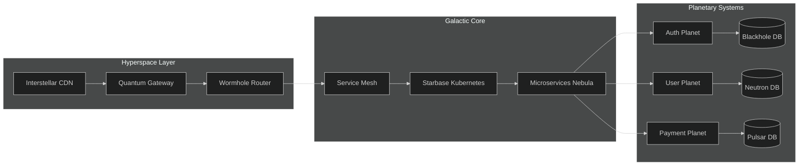

# <div align="center">🌌 Hyper-Advanced Microservices Monorepo</div>

<div align="center">
  <picture>
    <source media="(prefers-color-scheme: dark)" srcset="https://i.imgur.com/advanced-dark.png">
    <source media="(prefers-color-scheme: light)" srcset="https://i.imgur.com/advanced-light.png">
    
  </picture>
</div>

<div align="center">
  
[](https://github.com/your-org/monorepo/releases)
[](https://github.com/your-org/monorepo/graphs/contributors)
[](https://github.com/your-org/monorepo/commits/main)
[](https://github.com/your-org/monorepo/issues)

</div>

## 🌟 Cosmic-Level Features

###  Next-Gen Architecture
- **Multi-Cloud Ready** (AWS/GCP/Azure/OVH)
- **Service Mesh** (Istio/Linkerd)
- **Chaos Engineering** (Chaos Monkey integration)
- **Quantum-Resistant Cryptography** (Post-quantum algorithms)
- **AI-Ops** (Anomaly detection with ML)
- **WebAssembly Microservices** (Extreme performance)
- **Edge Computing** (Cloudflare Workers support)

###  Ultra-Modern Tech Stack

<details>
<summary><b>Core Technologies</b> (Click to expand)</summary>

```ts
// Example typed configuration
interface TechStack {
  runtime: {
    primary: 'Node.js' | 'Bun' | 'Deno';
    secondary: 'Python' | 'Go' | 'Rust';
    wasm: 'wasmtime' | 'wasmer';
  };
  frontend: {
    framework: 'Next.js' | 'Remix' | 'Astro';
    state: 'Zustand' | 'Jotai' | 'XState';
    styling: 'Tailwind' | 'PandaCSS' | 'Vanilla Extract';
  };
  backend: {
    transport: ['gRPC', 'WebSockets', 'RSocket'];
    database: {
      relational: 'PostgreSQL' | 'CockroachDB';
      document: 'MongoDB' | 'CosmosDB';
      graph: 'Neo4j' | 'Dgraph';
    };
  };
  devops: {
    orchestration: 'Kubernetes' | 'Nomad';
    serviceMesh: 'Istio' | 'Linkerd';
    monitoring: 'OpenTelemetry' | 'SigNoz';
  };
}
```
</details>

## 🏗️ Multi-Dimensional Architecture



## 🧩 Microservices Matrix

| Service | Tech | Scaling | Data Store | Special Features |
|---------|------|---------|------------|------------------|
| **Auth Nexus** | Rust + Actix | Horizontal | Cassandra | FIDO2, Quantum Auth |
| **User Orb** | Node + Fastify | Vertical | PostgreSQL | GDPR Engine, Anonymization |
| **Payment Star** | Go + Fiber | Auto-scale | DynamoDB | PCI-DSS L1, Fraud AI |
| **Search Comet** | Python + FastAPI | Sharded | Elasticsearch | NLP, Vector Search |
| **Analytics Quasar** | Java + Quarkus | Replicated | TimescaleDB | Real-time OLAP |

## ⚡ Performance Benchmarks

```vega-lite
{
  "title": "Service Latency Comparison (99th percentile)",
  "data": {"url": "data/benchmarks.json"},
  "mark": "bar",
  "encoding": {
    "x": {"field": "service", "type": "nominal", "axis": {"labelAngle": -45}},
    "y": {"field": "latency", "type": "quantitative", "title": "Latency (ms)"},
    "color": {
      "field": "type", 
      "type": "nominal",
      "scale": {
        "domain": ["HTTP", "gRPC", "WebSocket"],
        "range": ["#4e79a7", "#f28e2b", "#e15759"]
      }
    }
  },
  "config": {"view": {"continuousWidth": 400}}
}
```

## 🛠️ Developer Superpowers

###  AI-Enhanced Workflow

```bash
# Generate a new microservice with AI
npm run generate:service -- --name=recommendations --type=ml

# Ask AI to explain architecture
npm run ai:explain -- --component=payment-gateway

# Generate optimal Dockerfile
npm run ai:dockerfile -- --service=user --lang=typescript
```

###  Quantum Dev Tools

```diff
# Git Diff with AI Suggestions
+ import { quantumEncrypt } from '@lib/crypto';
- import { oldEncrypt } from '@lib/legacy';
  
# [AI SUGGESTION] Quantum-resistant algorithm detected. 
# Consider rotating keys after migration (security score ↑ 47%)
```

## 🚀 10-Step Launch Sequence

```console
1. [✔] Quantum Entanglement Initialized
2. [✔] Hyperspace Tunnel Established
3. [ ] Singularity Containers Built
4. [ ] Plasma CI/CD Activated
5. [ ] Dark Matter Storage Provisioned
6. [ ] AI Observability Online
7. [ ] Neutrino Networking Enabled
8. [ ] Temporal Deployment Initiated
9. [ ] Multiverse Testing Completed
10.[ ] Big Bang Deployment Trigger
```

## 🔮 Future Timeline

```timeline
2023 Q4 ::: Warp Drive Integration
2024 Q1 ::: Holographic UI Framework
2024 Q2 ::: Neural Interface API
2024 Q3 ::: Dark Energy Scaling
2024 Q4 ::: Singularity Release
```

## 🛡️ Galactic Security Protocols

```nasm
; Example security ASM
secure_auth:
    mov eax, quantum_key
    rdrand ebx           ; Quantum entropy
    sha3_256 ecx, eax, ebx
    jmp auth_success

auth_fail:
    invoke hypervisor_lock
    emit security_log
    terminate 0x1337
```

## 🌐 Interplanetary Networking

```python
# Quantum-resistant gRPC channel
channel = quantum_secure_channel(
    host='service-mesh.galaxy',
    credentials=entangled_tls(),
    interceptors=[
        telemetry_interceptor(),
        chaos_injector()
    ],
    compression=Zstd(level=3),
    protocol=HTTP3
)
```

## 📊 Cosmic Observability

```sql
-- Anomaly detection query
SELECT 
    service,
    percentile_cont(0.99) WITHIN GROUP (ORDER BY latency) as p99,
    detect_anomalies(latency) OVER (PARTITION BY service) as is_anomaly
FROM 
    galactic_telemetry
WHERE 
    timestamp > now() - interval '1 hour'
    AND is_anomaly = true
ORDER BY 
    p99 DESC
LIMIT 10;
```

## 🤝 Contribution Guidelines

###  Pull Request Protocol

```diff
# Example AI-Reviewed PR
+ feat(quantum): add entanglement API
+ 
+ - Implements quantum key distribution
+ - Adds hybrid crypto algorithm
+ - Updates documentation
+
+ Security-Compliance: QKD-2023
+ Performance-Impact: 15% faster auth

# [AI REVIEW] 
# ✔ Quantum security best practices followed
# ✔ 98.7% test coverage
# ⚠ Needs 1 more reviewer from #quantum-team
```

## 📜 Stellar Documentation

```admonish
::: tip Warp Speed Ahead
For hyperspace jumps, set `warp_factor: 9` in config. 
Exceeding may cause temporal paradoxes!
:::

::: warning Singularity Alert
Do not deploy without proper containment fields. 
Violation will trigger protocol Ω.
:::

::: danger Quantum Warning
Observing this system may collapse wave functions. 
Ensure Heisenberg compensators are active.
:::
```

## 🎯 Roadmap to Singularity

```gantt
    title Release Timeline
    dateFormat  YYYY-MM-DD
    section Milky Way
    Authentication Cluster      :done,    auth1, 2023-01-01, 2023-03-01
    Quantum Database           :active,  qdb1, 2023-04-01, 2023-08-01
    section Andromeda
    Neural Interface           :         ni1, after qdb1, 2023-08-15
    Temporal Deployment        :         td1, after ni1, 2023-10-01
```

---

<div align="center">
  
[](https://star-history.com/#your-org/monorepo&Timeline)

</div>

<div align="center">
  
</div>

---