## 🌐 Microservices Constellation Architecture

```mermaid
%%{init: {'theme': 'base', 'themeVariables': { 'primaryColor': '#1a1a2e', 'edgeLabelBackground':'#16213e', 'clusterBkg': '#0f3460'}}}%%
flowchart TD
    classDef service fill:#4ecca3,stroke:#333,stroke-width:2px;
    classDef db fill:#f8b500,stroke:#333,stroke-width:2px;
    classDef queue fill:#d9455f,stroke:#333,stroke-width:2px;
    classDef gateway fill:#206a5d,stroke:#333,stroke-width:2px;
    
    subgraph API_Gateways["🚀 API Gateways"]
        G1["🔒 Auth Gateway<br><small>JWT Validation<br>Rate Limiting<br>OAuth 2.0 Proxy</small>"]:::gateway
        G2["📡 API Gateway<br><small>GraphQL Federation<br>gRPC Transcoding<br>HTTP/3 Support</small>"]:::gateway
        G3["🌐 WebSocket Gateway<br><small>Socket.IO<br>Protocol Buffers<br>5M Concurrent</small>"]:::gateway
    end

    subgraph Core_Services["🛠️ Core Services"]
        S1["🔐 Auth Service<br><small>Node.js 20<br>TypeScript 5.3<br>Ory Hydra</small>"]:::service
        S2["👥 User Service<br><small>Go 1.21<br>gRPC<br>Ent ORM</small>"]:::service
        S3["💳 Payment Service<br><small>Rust 1.75<br>Tokio Runtime<br>PCI-DSS L1</small>"]:::service
    end

    subgraph Domain_Services["🧩 Domain Services"]
        S4["📦 Inventory Service<br><small>Java 21<br>Spring Boot 3<br>CQRS</small>"]:::service
        S5["🔍 Search Service<br><small>Python 3.12<br>FastAPI<br>Elasticsearch</small>"]:::service
        S6["📊 Analytics Service<br><small>Kotlin<br>Ktor Framework<br>Apache Flink</small>"]:::service
    end

    subgraph Infrastructure_Services["⚙️ Infrastructure Services"]
        S7["📡 Notification Service<br><small>Elixir<br>Phoenix<br>100K msg/sec</small>"]:::service
        S8["🔄 Workflow Service<br><small>Cadence<br>Temporal SDK<br>Saga Pattern</small>"]:::service
        S9["📝 Logging Service<br><small>F#<br>.NET 8<br>OpenTelemetry</small>"]:::service
    end

    subgraph Specialized_Services["✨ Specialized Services"]
        S10["🤖 AI Service<br><small>Python<br>PyTorch 2.1<br>ONNX Runtime</small>"]:::service
        S11["🛡️ Fraud Service<br><small>Scala 3<br>Akka Typed<br>ML Fraud Detection</small>"]:::service
        S12["🌍 Geo Service<br><small>Rust<br>Geohashing<br>PostGIS</small>"]:::service
    end

    subgraph Data_Stores["💾 Data Stores"]
        DB1["🗝️ Auth DB<br><small>PostgreSQL 16<br>Row-Level Security<br>PgBouncer</small>"]:::db
        DB2["👤 User DB<br><small>CockroachDB 23.2<br>Global Distribution<br>9-9s Availability</small>"]:::db
        DB3["💲 Payment DB<br><small>MongoDB 7.0<br>Client-Side Encryption<br>Change Streams</small>"]:::db
        DB4["📊 Inventory DB<br><small>Cassandra 5.0<br>TimeWindow Compaction<br>3x Replication</small>"]:::db
        DB5["🔍 Search Index<br><small>Elasticsearch 8.12<br>Vector Search<br>125M docs</small>"]:::db
        DB6["📈 Analytics DW<br><small>ClickHouse 23.11<br>Columnar Storage<br>Petabyte Scale</small>"]:::db
    end

    subgraph Message_Brokers["📨 Message Brokers"]
        Q1["🔄 Event Bus<br><small>Kafka 3.6<br>10M msg/sec<br>Schema Registry</small>"]:::queue
        Q2["📨 Task Queue<br><small>RabbitMQ 3.12<br>Quorum Queues<br>Mirrored</small>"]:::queue
        Q3["⚡ Realtime PubSub<br><small>NATS JetStream<br>100μs Latency<br>Persistent Streams</small>"]:::queue
    end

    %% Connections
    G1 -->|OIDC| S1
    G2 -->|gRPC| S2
    G2 -->|HTTP/2| S3
    G3 -->|WebSocket| S7
    
    S1 -->|JWT| G2
    S1 -->|Auth Data| DB1
    S2 -->|User CRUD| DB2
    S3 -->|Tx Logs| DB3
    
    S4 -->|Inventory| DB4
    S5 -->|Search Index| DB5
    S6 -->|OLAP| DB6
    
    S4 -->|Inventory Events| Q1
    S5 -->|Index Updates| Q1
    S7 -->|Notifications| Q3
    
    S10 -->|Model Updates| Q2
    S11 -->|Fraud Alerts| Q3
    S12 -->|Geo Queries| DB2
    
    %% Cross-service communication
    S2 -->|User Data| S3
    S3 -->|Payment Events| S11
    S6 -->|Analytics| S10
```



### 🔍 Deep Dive: Service Specifications

<details>
<summary><b>🔐 Auth Service Details</b></summary>

```typescript
interface AuthServiceSpec {
  runtime: {
    engine: "Node.js 20 (V8 11.3)";
    concurrency: "Cluster Mode (16 cores)";
    memory: "4GB Heap (ZGC)";
  };
  protocols: {
    auth: ["OIDC", "SAML 2.0", "WebAuthn"];
    encryption: ["AES-256-GCM", "ChaCha20-Poly1305"];
    hashing: ["Argon2id", "Scrypt"];
  };
  database: {
    type: "PostgreSQL 16";
    features: [
      "Row-Level Security",
      "JWT Token Storage",
      "Partitioned Tables"
    ];
    connectionPool: "PgBouncer (Transaction Mode)";
  };
  performance: {
    rps: "12,000 req/sec";
    latency: "p99 < 45ms";
    sessions: "5M concurrent";
  };
}
```
</details>

<details>
<summary><b>💳 Payment Service Details</b></summary>

```rust
// Payment Service Technical Specs
#[derive(Debug)]
pub struct PaymentServiceSpec {
    pub runtime: RuntimeSpec,
    pub transaction: TransactionSpec,
    pub compliance: ComplianceSpec,
}

pub struct RuntimeSpec {
    pub language: &'static str,       // "Rust 1.75"
    pub framework: &'static str,      // "Actix-Web 4.3"
    pub async_runtime: &'static str,  // "Tokio 1.32 (multi-thread)"
}

pub struct TransactionSpec {
    pub throughput: u32,              // 8,500 TPS
    pub settlement_latency: Duration, // p95 < 120ms
    pub currencies: Vec<&'static str>,// ["USD", "EUR", "BTC"]
}

pub struct ComplianceSpec {
    pub standards: Vec<&'static str>, // ["PCI-DSS L1", "PSD2", "SOX"]
    pub encryption: &'static str,     // "FIPS 140-2 L3"
    pub audit: AuditConfig,
}
```
</details>

## 📊 Service-Level SLAs

| Service | Availability | Throughput | Latency (p99) | Data Consistency | 
|---------|-------------|------------|---------------|------------------|
| **Auth** | 99.995% | 12K RPS | 45ms | Strong |
| **User** | 99.99% | 8K RPS | 65ms | Eventual |
| **Payment** | 99.999% | 8.5K TPS | 120ms | Strong |
| **Inventory** | 99.95% | 5K RPS | 85ms | Linearizable |
| **Search** | 99.9% | 15K QPS | 95ms | Eventual |
| **Analytics** | 99.5% | 1M EPS | 250ms | Eventually Consistent |

## 🔗 Communication Matrix


This diagram includes:

1. **12 Detailed Microservices** with:
   - Runtime environments
   - Programming languages
   - Key frameworks
   - Performance characteristics

2. **6 Database Technologies** with:
   - Version specifics
   - Replication strategies
   - Special features
   - Scaling capabilities

3. **3 Message Brokers** with:
   - Throughput metrics
   - Latency figures
   - Special configurations

4. **Interactive Elements**:
   - Click-to-expand service specifications
   - Color-coded connections
   - Protocol annotations
   - Performance SLAs

5. **Advanced Mermaid Features**:
   - Custom theme configuration
   - CSS class styling
   - Multi-subgraph organization
   - Detailed edge labeling
   - Directional flows

6. **Type-Safe Specifications**:
   - TypeScript interfaces
   - Rust structs
   - Complete configuration details

The diagram provides a complete architectural overview while allowing deep inspection of each component's technical characteristics.